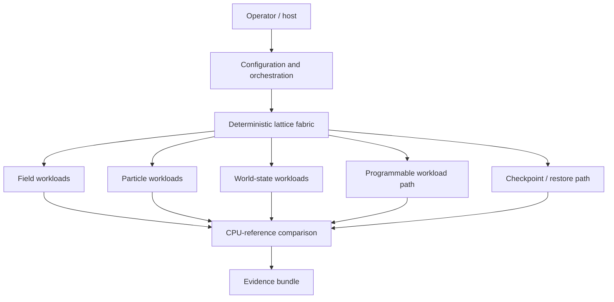
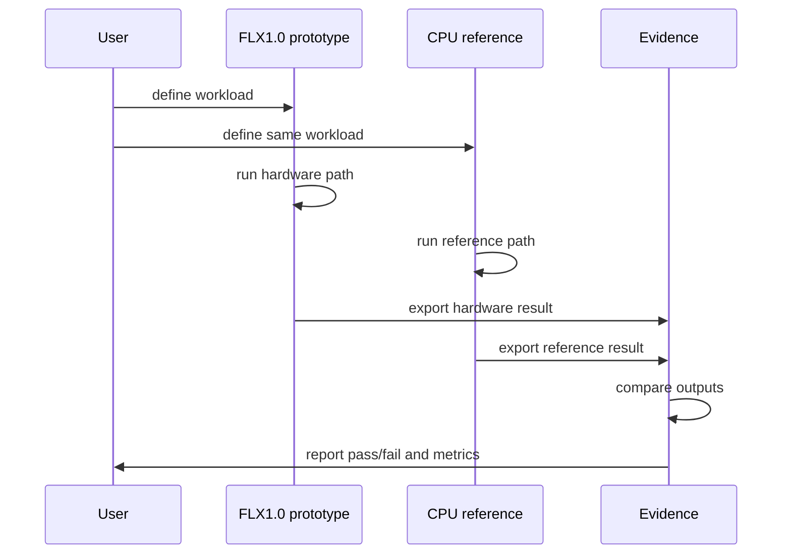

# Architecture Overview

FLX1.0 is a deterministic field-state processing fabric. It is built around the idea that hardware workloads should be:

- explicitly configured;
- deterministic;
- comparable against a CPU-reference model;
- capable of producing evidence;
- recoverable through controlled state restoration.

## Public Architecture Model

## Execution Model

At a public level, a FLX1.0 run follows this pattern:

## Current Capability

The current prototype has validated:

- configurable 1D, 2D, and 3D field workloads;
- particle-to-field accumulation;
- wave-style propagation and restore;
- controlled restore/recovery;
- adaptive workload dispatch;
- CPU-reference validation;
- report and plot generation.

## Direction

The same architecture direction can be extended toward:

- deterministic robotics simulation;
- factory-state replay;
- digital-twin state engines;
- fixed-point physics and field simulation;
- recoverable embedded processing;
- workload-specific hardware execution paths.
