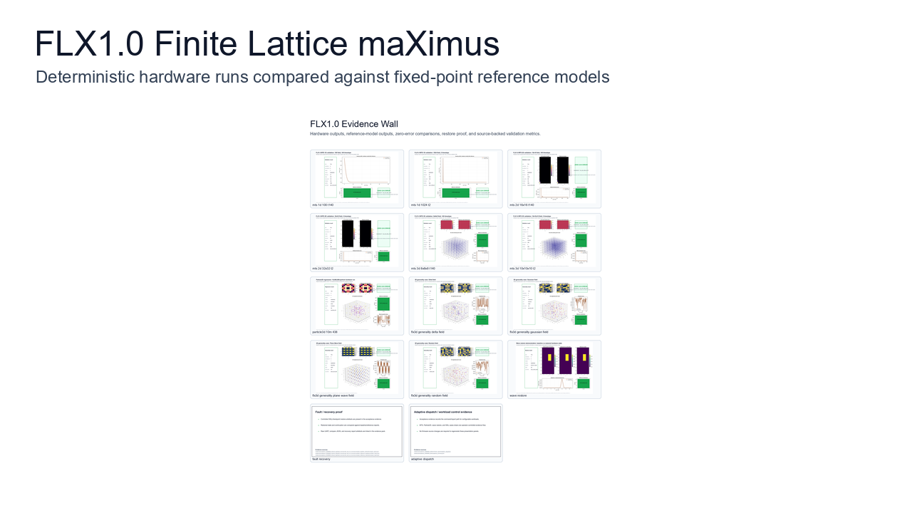
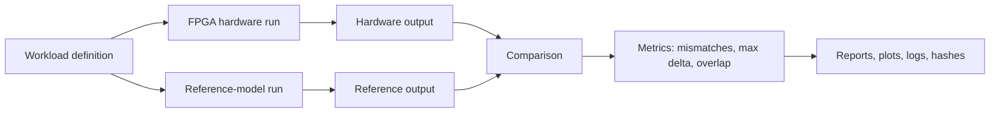

# FLX1.0

**Finite Lattice maXimus: a deterministic FPGA lattice/field-state processing fabric with CPU-reference validation, replay, and controlled recovery.**

FLX1.0 stands for **Finite Lattice maXimus**.

Start here for the shortest review path:

- [START_HERE.md](START_HERE.md)
- [VALIDATION_RESULTS.md](VALIDATION_RESULTS.md)
- [EVIDENCE_CORRELATION.md](EVIDENCE_CORRELATION.md)
- [MEDIA/evidence_panels/lattice_memory_layout_panel.png](MEDIA/evidence_panels/lattice_memory_layout_panel.png)
- [MEDIA/evidence_panels/cpu_vs_flx_benchmark_panel.png](MEDIA/evidence_panels/cpu_vs_flx_benchmark_panel.png)
- [MEDIA/evidence_panels/adaptability_flash_boot_panel.png](MEDIA/evidence_panels/adaptability_flash_boot_panel.png)
- [MEDIA/videos/flx1_evidence_demo.mp4](MEDIA/videos/flx1_evidence_demo.mp4)

FLX1.0 is a prototype finite-lattice processing fabric for workloads where the important question is not only "did it run?", but:

- did the hardware result match the reference model exactly?
- can the run be replayed?
- can state be checkpointed and restored?
- can the same fabric handle field, particle, world-state, and programmable workloads?
- can logical 1D/2D/3D fields be mapped deterministically into physical lattice memory?

## Latest Hardware Evidence

The latest hardware acceptance run passed on **8 June 2026**.

| Area | Evidence | Result |
|---|---|---:|
| Full board acceptance suite | [acceptance_20260608_full](evidence/acceptance_20260608_full/README.md) | Pass |
| 100T build and timing gate | [board_deployment_20260608](evidence/board_deployment_20260608/README.md) | Pass |
| 100T config-memory program/verify | [board_deployment_20260608](evidence/board_deployment_20260608/README.md) | Pass |
| Cmod config-memory program/verify | [board_deployment_20260608](evidence/board_deployment_20260608/README.md) | Pass |
| SPI health, Cmod mirror, live board run | [board_acceptance_20260608_135515.stdout.log](evidence/board_deployment_20260608/board_acceptance_20260608_135515.stdout.log) | Pass |
| Configurable 1D/2D/3D field workloads | [acceptance_summary.json](evidence/acceptance_20260608_full/acceptance_summary.json) | Pass |
| 1024-active-point capability checks | [acceptance_summary.json](evidence/acceptance_20260608_full/acceptance_summary.json) | Pass |
| 10,000,000-particle 3D regression | [particle3d_438](evidence/acceptance_20260608_full/particle3d_438) | Pass |
| Controlled WAL/recovery proof | [fault_recovery](evidence/acceptance_20260608_full/fault_recovery) | Pass |
| Lattice memory mapper and router proof | [lattice_memory_20260608](evidence/lattice_memory_20260608/README.md) | Pass |
| CPU-vs-FLX benchmark comparison | [cpu_vs_flx_20260608](evidence/cpu_vs_flx_20260608/README.md) | Pass |
| Flash-booted programmable adaptability suite | [adaptability_flash_boot_20260608](evidence/adaptability_flash_boot_20260608/README.md) | Pass |

The validated comparisons report:

- final fixed-point mismatches: **0**
- maximum fixed-point delta: **0**
- reference-model comparison: **pass**
- controlled restore/recovery comparison: **pass**
- live board lattice-map cross-checks: **51 / 51 pass**
- host lattice mapping coverage: **48 / 48 pass**
- CPU-vs-FLX benchmark exact matches: **3 / 3 pass**
- flash-booted programmable adaptability exact matches: **11 / 11 pass**

## What Was Demonstrated

| Capability | Validated Result |
|---|---:|
| 1D field workload, 100 points, 140 steps | Pass, mismatches 0 |
| 2D field workload, 16 x 16, 140 steps | Pass, mismatches 0 |
| 3D field workload, 8 x 8 x 8, 140 steps | Pass, mismatches 0 |
| 1D cap check, 1024 points | Pass, mismatches 0 |
| 2D cap check, 32 x 32 | Pass, mismatches 0 |
| 3D cap check, 10 x 10 x 10 | Pass, mismatches 0 |
| Particle3D regression, 10,000,000 particles, 438 steps | Pass, mismatches 0 |
| Wave restore demo | Pass, mismatches 0 |
| WAL-controlled recovery | Pass, mismatches 0 |
| Adaptive dispatch | Pass |
| Lattice layouts: row, snake, Morton | Pass |
| Route mailbox local read/status | Pass |
| CPU-style VM, SHA-256, and robot-grid comparison | Pass, exact matches 3 / 3 |
| Flash-booted VM/load/reduction/world-state workload suite | Pass, exact matches 11 / 11 |

## Technical Evidence Archive

Current evidence:

- [evidence/acceptance_20260608_full](evidence/acceptance_20260608_full/README.md)
- [evidence/board_deployment_20260608](evidence/board_deployment_20260608/README.md)
- [evidence/lattice_memory_20260608](evidence/lattice_memory_20260608/README.md)
- [evidence/cpu_vs_flx_20260608](evidence/cpu_vs_flx_20260608/README.md)
- [evidence/adaptability_flash_boot_20260608](evidence/adaptability_flash_boot_20260608/README.md)

Prior evidence retained for comparison:

- [evidence/acceptance_20260606_full](evidence/acceptance_20260606_full/README.md)
- [evidence/flx3d_generality_20260524](evidence/flx3d_generality_20260524/summary.json)

The evidence folders include raw UART logs, runner logs, JSON summaries, comparison reports, CSV result artefacts, plots, and SHA-256 file hashes.

## Presentation Media

The [`MEDIA`](MEDIA/README.md) folder contains presentation media generated from the evidence artefacts.

Useful review visuals:

- [Lattice memory layout proof panel](MEDIA/evidence_panels/lattice_memory_layout_panel.png)
- [CPU-vs-FLX benchmark panel](MEDIA/evidence_panels/cpu_vs_flx_benchmark_panel.png)
- [Flash-boot adaptability panel](MEDIA/evidence_panels/adaptability_flash_boot_panel.png)
- [2D layout map: row, snake, Morton](MEDIA/plots/lattice_layout_2d_32x32_row_snake_morton.png)
- [3D layout map: 8 x 8 x 8](MEDIA/plots/lattice_layout_3d_8x8x8_row_snake_morton.png)
- [3D layout map: 10 x 10 x 10](MEDIA/plots/lattice_layout_3d_10x10x10_row_snake_morton.png)
- [Evidence wall](MEDIA/flx1_evidence_wall.png)
- [Evidence demo video](MEDIA/videos/flx1_evidence_demo.mp4)
- [Media file hashes](MEDIA/MEDIA_MANIFEST.json)

## Evidence Flow

## Current Workload Classes

- **Field-state workloads:** configurable 1D, 2D, and 3D field evolution.
- **Particle-field workloads:** deterministic particle accumulation into a 3D field.
- **Wave/world demo:** wave-style propagation with restore and comparison.
- **Adaptive workload routing:** field, SHA-style, robotics-style, and programmable workload classes.
- **Flash-booted programmable workload diversity:** VM RAM load, integer bitwork, Q16 fixed-point arithmetic, reductions, lattice-neighbour addressing, and world-state local-rule cases.
- **Recovery proof:** controlled restore path compared against baseline and reference-model output.
- **Lattice memory mapping:** row-major compatibility, serpentine/snake layout, and Morton/Z-order layout with live board cross-checks.

## Core Claim Supported By This Evidence

> A deterministic FPGA-based finite-lattice compute fabric can run multiple validated grid/world-state workloads, compare hardware results against a reference model, preserve evidence, restore controlled state, and address logical 1D/2D/3D lattice memory through a deterministic layout contract.

## Read More

- [VALIDATION_RESULTS.md](VALIDATION_RESULTS.md)
- [BENCHMARKS.md](BENCHMARKS.md)
- [EVIDENCE_CORRELATION.md](EVIDENCE_CORRELATION.md)
- [EVIDENCE_MANIFEST.md](EVIDENCE_MANIFEST.md)
- [MEDIA/README.md](MEDIA/README.md)
- [ARCHITECTURE_OVERVIEW.md](ARCHITECTURE_OVERVIEW.md)
- [APPLICATIONS.md](APPLICATIONS.md)
- [NOTICE.md](NOTICE.md)
- [CONTACT.md](CONTACT.md)
