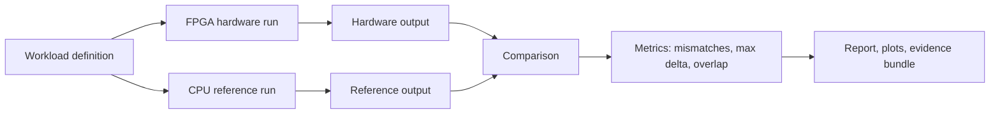
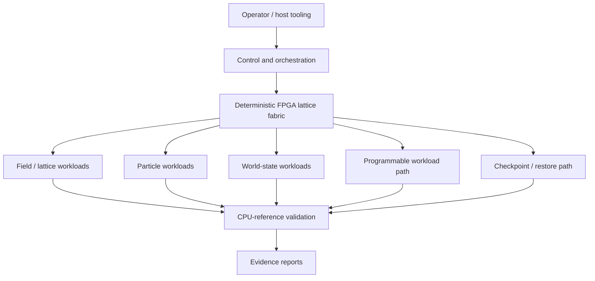

# FLX1.0

**Finite Lattice maXimus: a deterministic FPGA lattice/field-state processing fabric with CPU-reference validation, replay, and controlled recovery.**

FLX1.0 stands for Finite Lattice maXimus.

FLX1.0 is a prototype deterministic processing fabric for workloads where the important question is not only "did it run?", but:

- did the hardware result match the reference model exactly?
- can the run be replayed?
- can the state be checkpointed and restored?
- can the same fabric handle field, particle, world-state, and programmable workloads?

The current FLX1.0 prototype has completed a hardware acceptance run covering field simulation, particle accumulation, restore/recovery, adaptive workload dispatch, and evidence/report generation.

## Why This Exists

Ordinary CPU/GPU software stacks are powerful, but many physical-world systems need more than raw throughput:

- deterministic replay;
- fixed-contract validation against a reference model;
- state persistence;
- controlled restore after interruption;
- repeatable world-state evolution;
- hardware-assisted execution for grid, field, and local-state workloads.

FLX1.0 explores that space: a deterministic field-state processing fabric that can run workloads, compare them against a CPU reference, and preserve evidence about what happened.

## What Has Been Demonstrated

The latest hardware acceptance run passed on **6 June 2026**.

Validated public results:

| Area | Result |
|---|---:|
| Full hardware acceptance suite | Pass |
| Configurable 1D field workload | Pass |
| Configurable 2D field workload | Pass |
| Configurable 3D field workload | Pass |
| 1024-active-point capability checks | Pass |
| 10,000,000-particle 3D regression | Pass |
| 438-step deterministic 3D run | Pass |
| CPU-reference comparison | Pass |
| Final fixed-point mismatches in validated comparisons | 0 |
| Maximum fixed-point delta in validated comparisons | 0 |
| Controlled restore/recovery proof | Pass |
| Wave propagation restore demo | Pass |
| Adaptive dispatcher proof | Pass |
| Hardware health checks | Pass |
| Documentation/help audit | Pass |
| RTL simulation proof | Pass |

The 10,000,000-particle 3D regression matched the CPU-reference output with:

- final field mismatches: **0**
- maximum fixed-point delta: **0**
- normalized overlap: **1.0**

## Evidence Flow

## Architecture View

## Current Workload Classes

- **Field-state workloads:** configurable 1D, 2D, and 3D field evolution.
- **Particle-field workloads:** deterministic particle accumulation into a 3D field.
- **Wave/world demo:** wave-style propagation with restore and comparison.
- **Adaptive workload routing:** field, SHA-style, robotics-style, and generic programmable workload classes.
- **Recovery proof:** controlled restore path compared against baseline and CPU-reference output.

## Why It Matters

The core claim demonstrated by this prototype is:

> A deterministic FPGA-based field-state processing fabric can run multiple validated grid/world-state workloads, compare hardware results against a CPU-reference model, preserve evidence, and demonstrate controlled recovery behavior.

That is relevant to:

- robotics simulation and replay;
- factory/digital-twin state engines;
- deterministic physical-world control loops;
- scientific field simulation;
- fault-recoverable embedded processing;
- hardware-accelerated world-state experimentation.

## Read More

- [VALIDATION_RESULTS.md](VALIDATION_RESULTS.md)
- [BENCHMARKS.md](BENCHMARKS.md)
- [ARCHITECTURE_OVERVIEW.md](ARCHITECTURE_OVERVIEW.md)
- [APPLICATIONS.md](APPLICATIONS.md)
- [EVIDENCE_MANIFEST.md](EVIDENCE_MANIFEST.md)
- [NOTICE.md](NOTICE.md)
- [CONTACT.md](CONTACT.md)
